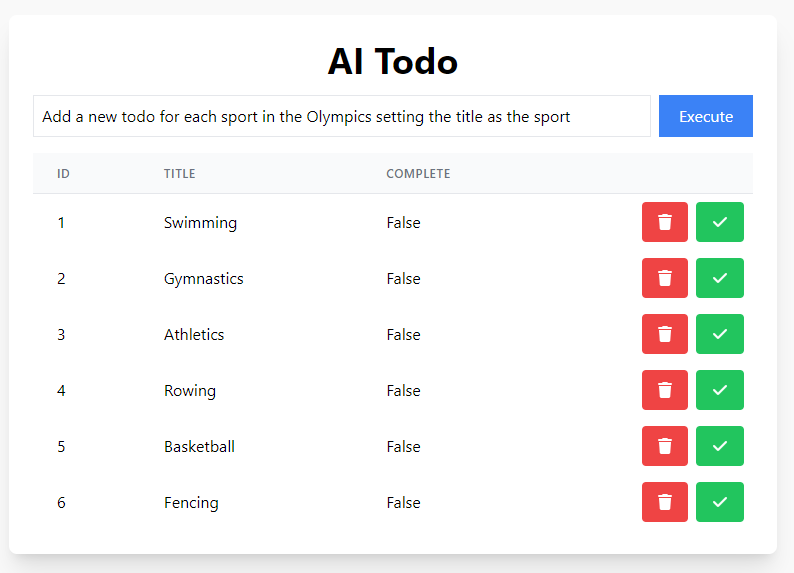
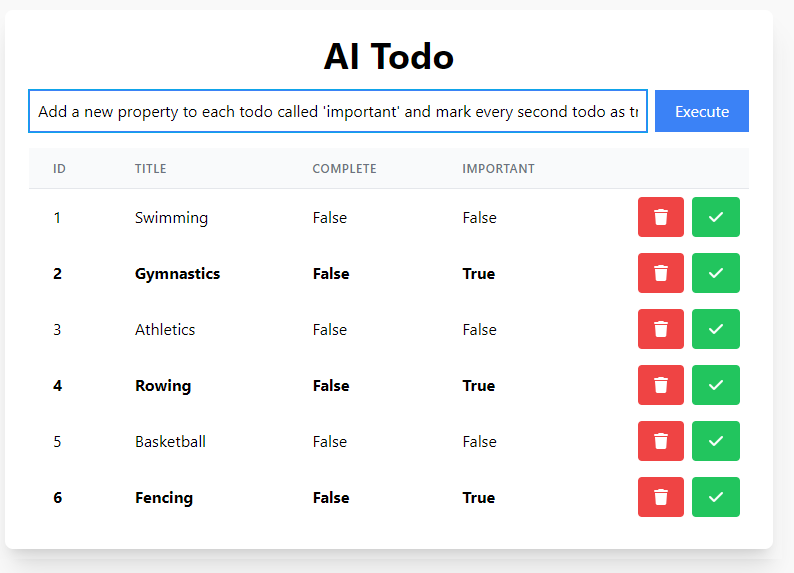
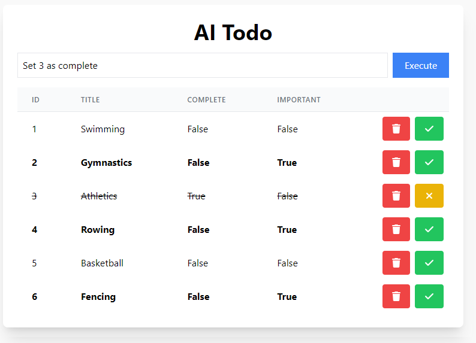
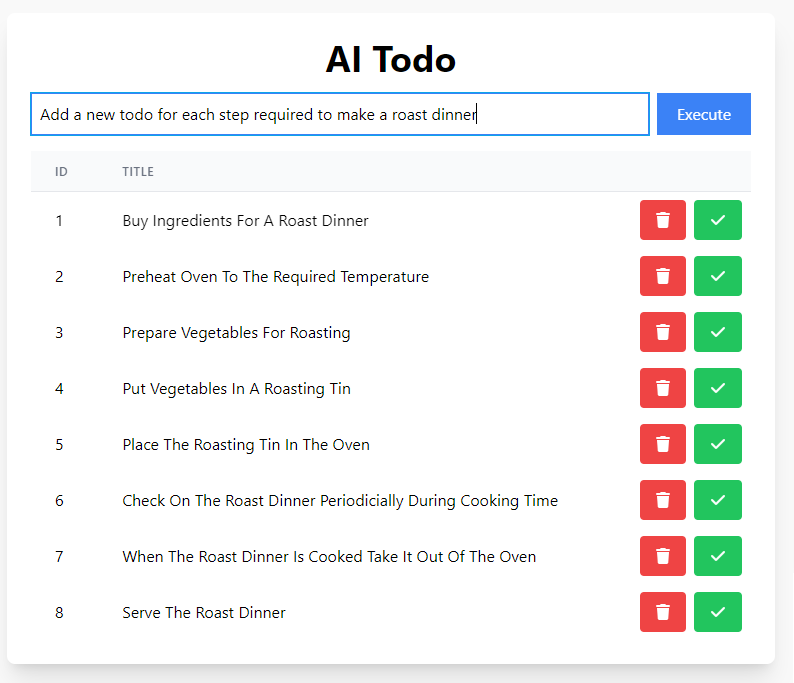

# AI Todo
AI todo is a generic todo app that uses GPT as the back end. 

## How to run

### Server:

Add your Open Ai API key to .env as `OPEN_AI_API_KEY`

```
cd server
npm i
node server/api.js 
```

### App:

```
cd app
npm i
npm start
```

Now you can try a prompt like:
 ```
 Add a todo for each sport in the olympics
 ```
or
```
Add a property called 'important' and make it true for every second item
```

Here are some examples:
```
Add a new todo for each sport in the Olympics setting the title as the sport
```

```
Add a new property to each todo called 'important' and mark every second todo as true
```

```
Set 3 as complete
```

```
Add a new todo for each step required to make a roast dinner
```
