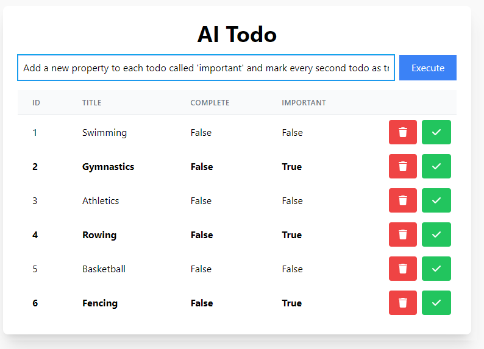
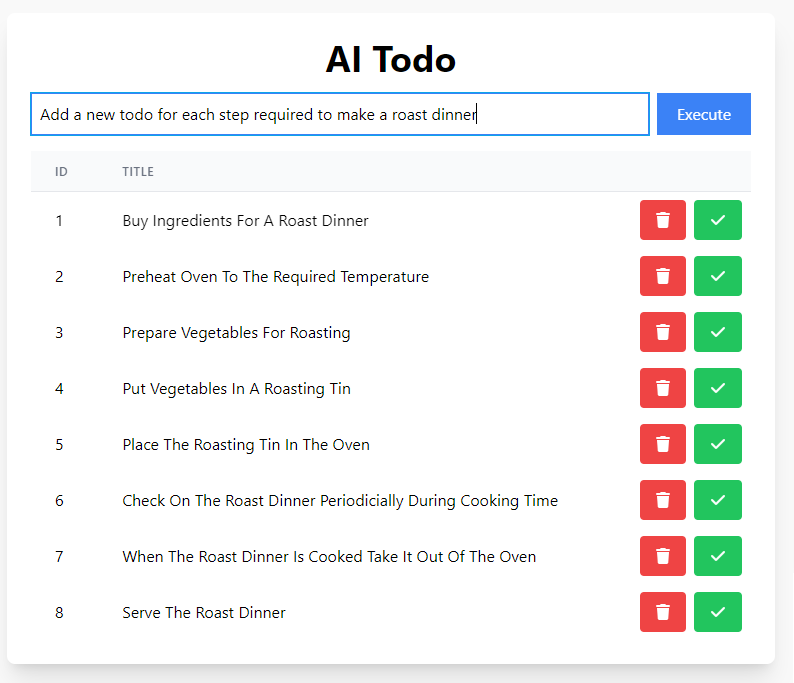

# AI Todo
AI todo is a generic todo app that uses GPT as the back end. 

The server is a simple api that can be called to set the state of the JSON 'database' which is stored in memory, this is passed to GPT with a prompt to manipulate that JSON and return with the response. 

There are some predefined prompts such as "mark as complete/incomplete" or "delete", but the fun part is using the generic prompt end point to give a prompt and have it be applied to the JSON. 

The app is just a react todo that consumes a JSON object and displays it. Some functionality is added here such as making a todo bold if it has the property `important` set to true or a property called `complete` which will set the text to be strike through. 

## How to run

### Root
```
npm i
```

### Server:

Add your Open Ai API key to .env as `OPEN_AI_API_KEY`

```
cd server
npm i
nodemon server/api.js 
```

### App:

```
cd app
npm i
npm start
```

## Examples:
```
Add a new todo for each sport in the Olympics setting the title as the sport
```

```
Add a new property to each todo called 'important' and mark every second todo as true
```

```
Set 3 as complete
```

```
Add a new todo for each step required to make a roast dinner
```
